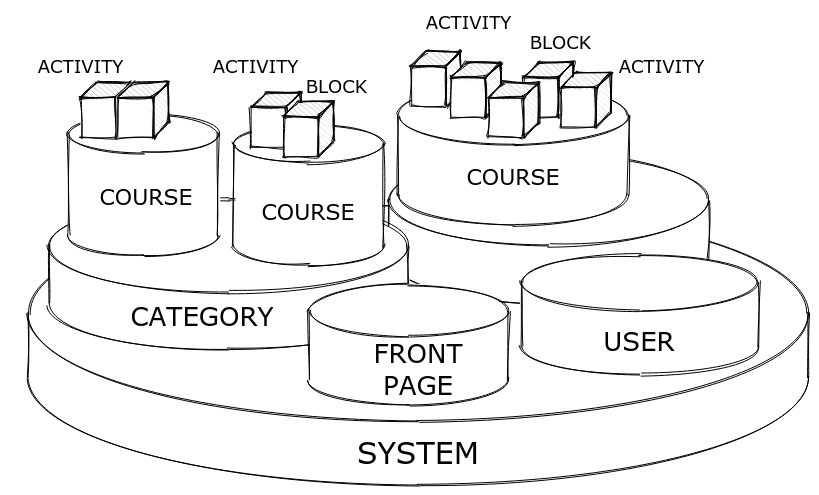

# Elementos básicos de acceso y seguridad de Moodle


Moodle context: es un lugar donde se asignan permisos a un usuario (generalmente a través de un rol). En Moodle, los contextos se superponen en una jerarquía.


Por ejemplo un usuario que es estudiante, solo tiene este rol dentro de los cursos, fuera de ellos es solo un usuario logeado.

El administrador puede editar las capacidades de cada rol.

Un sitio de Moodle está organizado en una jerarquía de áreas denominadas contextos y los usuarios se convierten en estudiantes o profesores en contextos individuales, como cursos.



* El nivel raíz de la jerarquía es el contexto del sistema que representa todo el sitio.
* En la parte superior hay un árbol de contextos de categorías de cursos.
* Cada curso tiene su propio contexto de curso.
* Dentro de los contextos del curso hay contextos de módulos que representan instancias de módulos de actividades particulares y contextos de bloques que representan bloques.
* La página principal del sitio se implementa internamente como un curso, por lo que el contexto de la página principal es en realidad uno de los contextos de nivel de curso para ese curso de sitio en particular.
* Finalmente, el contexto de usuario representa a un usuario determinado.

#### Ejemplo

Tengamos un rol personalizado "Spammer" que prohíba al usuario iniciar nuevas discusiones y responder a las publicaciones del foro. Si este rol está asignado a un usuario en el nivel de contexto del sistema, evita que el usuario publique en cualquier parte del sitio. Si el rol se asigna al usuario en un nivel de contexto de curso particular, el usuario no puede publicar en foros en este curso en particular, pero puede publicar en foros en otros cursos. El rol también podría asignarse en el nivel de contexto del módulo y afectar solo a un foro.

### Control de acceso

Su código nunca debe verificar qué rol tiene el usuario. Nunca debe diseñar e implementar el código con construcciones como "si el usuario es estudiante, entonces..." o "si el usuario es profesor, entonces...".

En su lugar, piense en un buen conjunto de capacidades que describan todas las funciones proporcionadas por el complemento. Declarar estas capacidades en el archivo `db/access.php` de su complemento junto con valores predeterminados sensibles para roles de arquetipo. Luego verifique si el usuario tiene la capacidad dada a través de los métodos `has_capability()` y `require_capability()`.

[Ver más sobre capacidades](https://docs.moodle.org/dev/Access\_API)

### Requerir que los usuarios inicien sesión

Dentro de nuestro complemento agregar el siguiente código luego de `$PAGE->set_heading(get_string('pluginname', 'local_greetings'));`

```php
require_login();
```

Ahora, evitemos que los usuarios invitados también accedan al complemento. Agregar el siguiente código debajo de `require_login()`;

```php
if (isguestuser()) {
    throw new moodle_exception('noguest');
}
```

### Sesskey protection <a href="#yui_3_17_2_1_1661956915963_45" id="yui_3_17_2_1_1661956915963_45"></a>

Incluso si el complemento verifica correctamente la autenticación y la autorización ahora, aún se debe agregar una protección esencial: sesskey.

Dentro del archivo index del complemento, antes del código que permite eliminar post (si eso permite el complemento) `if ($action == 'del') {`, agregar lo siguiente:

`require_sesskey();`

Al ingresar al complemento e intentar eleminar, indicará que requiere sesskey. Dentro de index se debe actualizar el link para eliminar pasandole el parámetro del sesskey

`'sesskey' => sesskey()`


La API de formularios de Moodle pasa automáticamente la clave de sesión del usuario y la verifica cuando se envían los datos del formulario. Por lo tanto, no es necesario llamar require\_sesskey() cuando se utiliza la API de formularios para procesar la entrada del usuario.


s

